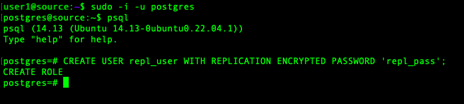
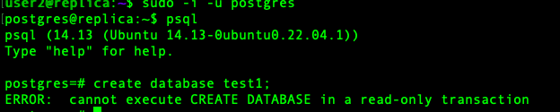

PostgreSQL Streaming Replication is a method for setting up real-time replication between a primary (master) PostgreSQL server and one or more standby (replica/slave) servers. It ensures that changes (WAL – Write-Ahead Logs) from the primary are continuously streamed to the standby, allowing it to maintain an up-to-date copy of the database for failover, read scaling, or backup purposes.

Characteristics of Streaming Replication
1. Primary and Standby Setup: The setup involves configuring a master (primary) server and a replica (standby) server, which is characteristic of streaming replication.
2. Base Backup: The pg_basebackup command is used to create a copy of the primary server’s data, which is a standard method in streaming replication.
3. WAL Streaming: The use of -X stream in the pg_basebackup command indicates that the Write-Ahead Logs (WALs) are streamed to the standby server in real-time, which is the core of streaming replication.
4. Hot Standby: The replica server is set up in hot standby mode, allowing read-only queries while continuously applying changes from the master. This is another key feature of streaming replication.
5. Replication Slots: The use of replication slots (pg_replication_slots) ensures that WAL segments are retained on the primary server until they are consumed by all connected standby servers. This prevents the WAL files from being removed prematurely, which is critical in streaming replication.

Synchronous vs. Asynchronous Replication

    Asynchronous Replication: The described setup appears to be asynchronous by default unless specifically configured otherwise. This means the master server does not wait for confirmation from the standby before committing transactions, allowing for lower latency but with a risk of data loss in case of a failure before the data is replicated.

    Synchronous Replication: If you want to ensure no data is lost, you can configure the replication as synchronous by setting the synchronous_commit parameter on the primary server and specifying the synchronous standby names in the synchronous_standby_names parameter.

Asynchronous Streaming Replication

This type of replication is widely used for high availability, where the standby server is kept up-to-date with the primary server’s transactions in near real-time. Note: Named the primary server as source (ip 192.168.1.4 ) and the standby server as replica (ip 192.168.1.5).

STEP1: Configuring Primary Server

    1. On primary server, configure the IP address(es) listen to for connections from clients in postgresql.conf by removing # in front of listen_address and give the IP address of Replica server.

    ( /etc/postgresql/14/main/– edit postgresql.conf)

    listen_addresses = ‘*’ 

    2. Now, connect to PostgreSQL on the primary server and create a replica login.

    CREATE USER repl_user WITH REPLICATION ENCRYPTED PASSWORD ‘repl_pass’;

    3. Enter the following entry pg_hba.conf file which is located in /etc/postgresql/14/main.

    host replication repl_user 192.168.1.5/24 md5

    4. Now, restart the PostgreSQL on the Primary server by using the below command.

        sudo systemctl restart postgresql.service
    

    Check systemctl status postgresql@14-main.service, whether it’s working or not.

STEP2: Configurations on standby server:
    1. Create a directory ( /opt/psql-replication) where the database will be replicated from the primary server. (In a production environment, the replication data should be stored on external or attached storage for fault tolerance.)

    

    2. Edit postgresql.conf and mark /opt/psql-replication as default directory.

    3. We have to stop PostgreSQL on the Standby server by using the following command.

        sudo systemctl stop postgresql.service

    4. Now, switch to the postgres user and take a backup of the main data directory.

       Note: This step is required if you want to replicate to a different directory, such as /opt/psql-replication, rather than the system’s default data path.
       
       sudo -i -u postgres
       cp -r /var/lib/postgresql/14/main/ /var/lib/postgresql/14/main_old/

    Now, remove the contents of the main(data) directory on the standby server.

       rm -rf /var/lib/postgresql/14/main/
    

    5. Now, use basebackup to take the base backup with the right ownership with postgres(or any user with right permissions).
     
       pg_basebackup -h 192.168.1.4 -D  /opt/psql-replication -U repl_user -P -v -R -X stream -C -S slaveslot1

    
    6. Important : the backup directory should be owned by postgres user 

    In our case please use the following commands.

       sudo chown -R postgres:postgres /opt/psql-replication

       sudo chmod 700  /opt/psql-replication

    7. Check the directory where the replication is done.

    8. Login to psql from primary server

       Use below mentioned command to check slaveslot1 is created or not.

       SELECT * FROM pg_replication_slots;

    
       Note: If you want to remove slaveslot1, use the following command.

       SELECT pg_drop_replication_slot(‘slaveslot1’);

    9. Login to psql from replica server

       Notice that standby.signal is created and the connection settings are appended to postgresql.auto.conf.

    A replication slave will run in “Hot Standby” mode if the hot_standby parameter is set to on (the default value) in postgresql.conf and there is a standby.signal file present in the data directory.

STEP3. Test replication setup
    10. Now start PostgreSQL on a standby server.

    sudo systemctl start postgresql

    Note : Make sure postgresql@42-main.service should be running properly.

    11. Now, try to create an object or database in a replica standby server. It throws an error, because replica(standby) is a read-only server.

    create database test1;

    Note: standby should not allow us to create any DB, because it is in read only mode.

  

    12. We can check the status on standby using the below command.

    SELECT * FROM pg_stat_wal_receiver;

    13. Now, verify the replication type synchronous or asynchronous using below command on primary database server.

    SELECT * FROM pg_stat_replication;

    14. Create new DB in primary server for testing

    CREATE DATABASE test1;

    List the DB using the following command.

    \l

    15. Login to the standby server.

    Check DB is replicated or not.

